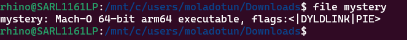
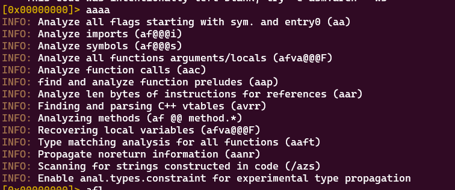
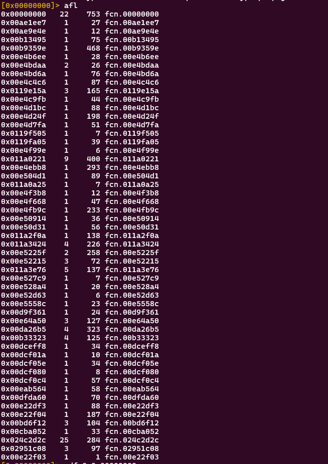
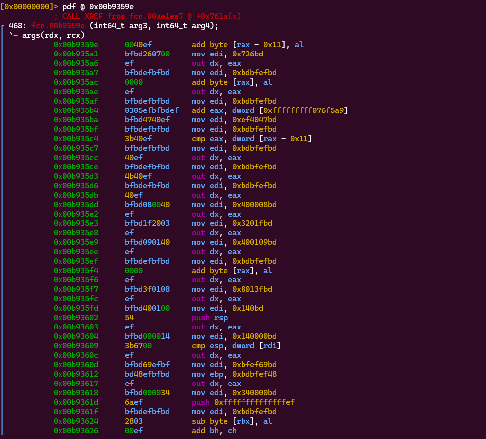
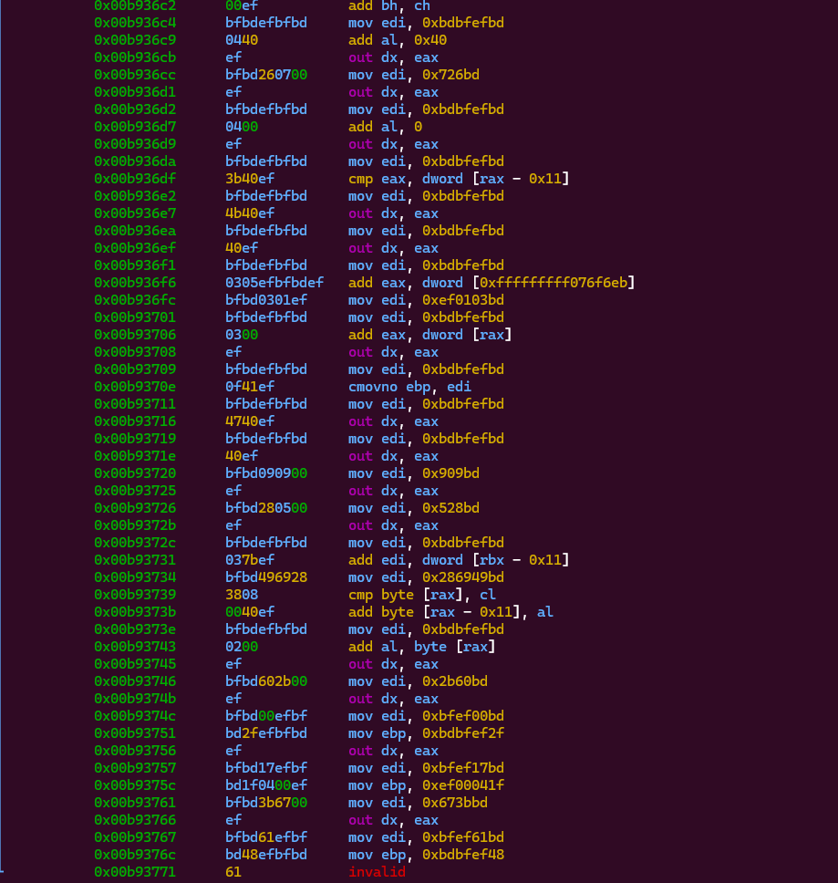

# Reverse Engineering the mystery binary file. 

## Steps
1. I determined the type of binary file and identified it to be a format used by MACOS

2. Disassemble the binary code using radare2.
I analyzed the binary file by examining the code 

3. I ran `afl` to list the functions detected within the binary 

These are all the functions in the file and any can be examined to see the code details. I used one for example to show. 

`pdf @ 0x00b9359e`

